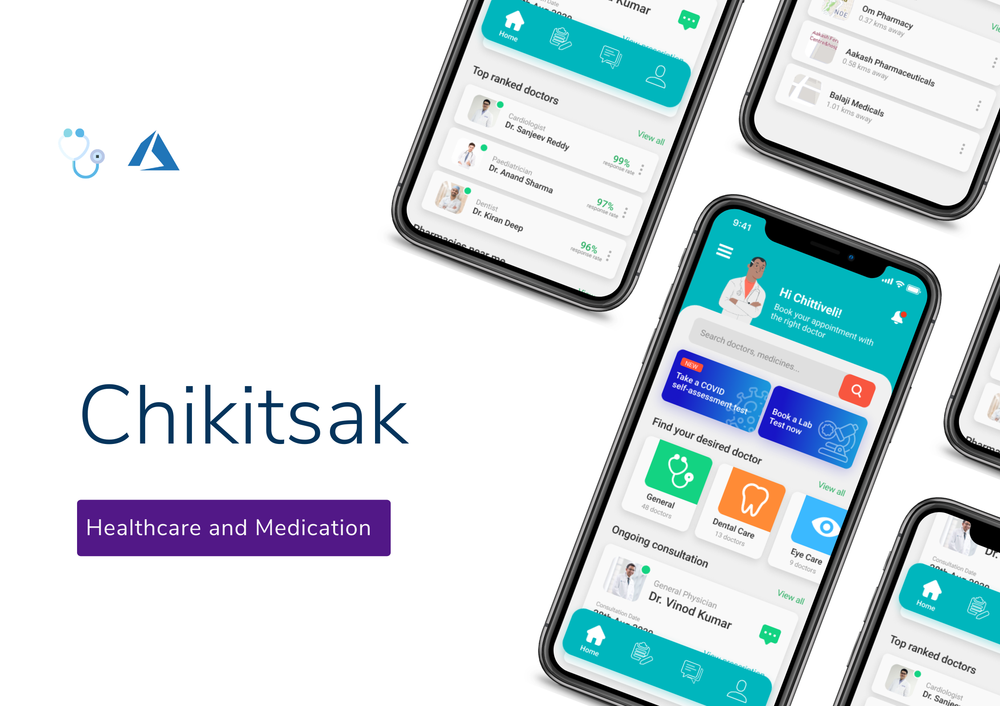
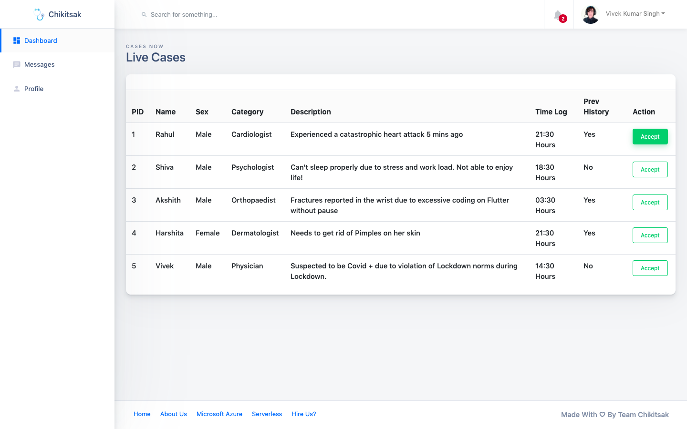
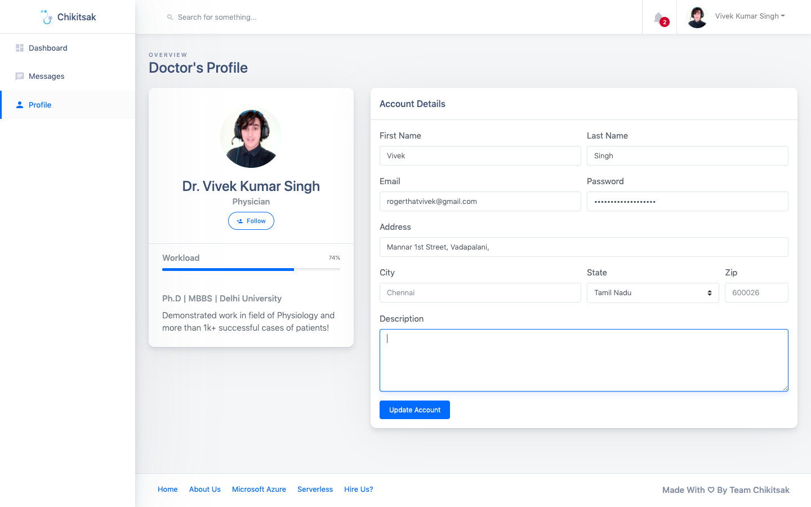
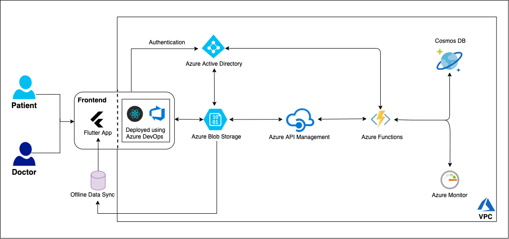
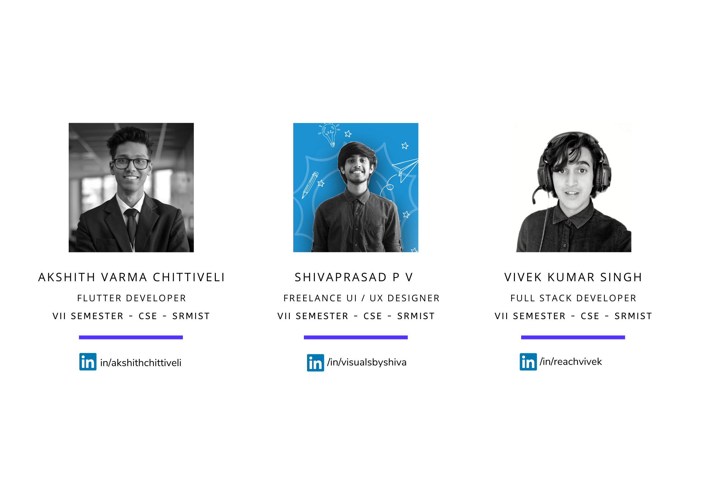

<p align="center"></p>

<h1 align="center">CHIKITSAK </br>#Microsoft Azure Champions League'20 (Hack-1) </H1>
<p align="center">
   <a target="_blank" href="https://www.hackerearth.com/challenges/hackathon/microsoft-azure-champions-league-hack-1/">
        
   </a>
</p>

<h1 align="center">About</H1>

Chikitsak has been made to scale up the existing telemedicine and Patient MIS in rural areas using Azure Services and Serverless Architecture to provide a cost-economic one stop solution which is dependable and truly secure. The objective is to give the citizens a **Live Doctor Interface** which has a **serverless architecture** and can be remotely accessed irrespective of patient's geographical location. 

> **Note:** This is ```Not An Open Source Project``` and is intended to be shared only with ```HackerEarth Officials``` & respective organizers of ```#Microsoft Azure Champions League``` for Validation of my Idea Subission and Evaluation Purposes. Please check this link below to better understand the license agreement of this repository: <a target="_blank" href="https://choosealicense.com/no-permission/">
          <p align="center"> <strong>About Proprietary Code & Repository | GitHub</strong> </p> </a> 
          






## Features 💬
1. Once user installs Chikitsak on his phone, he can schedule a test, communicate with a doctor, request appointment and view all his previous data in a cost effective way.

2. Chikitsak has a serverless architecture:

     * Our prime focus is on user's **cost** and **privacy**. The passwords are securely stored without the intervention of any third-party applications and this **prevents dataleaks** from occuring.
     * It is highly **reliable**.
     * Requires **very low maintenance**.
     * It is **highly scalable** - if many people want to use the same account to store different family user's data.

3. Doesn't require any subscription:

    * It is available **free** of cost for students/people having Azure Student account.
    * For rest of the users, there is **minimal payment** for Azure account which is equivalent to a meal from one of your favourite burger joints.

## Getting Started

### There are two facets of this solution
* Doctor Side - Dashboard (React)
* Patient Side - Mobile App (Flutter)

#### Azure Services Used 🔍
* DevOps
* Active Directory (A2D)
* Blob Storage
* Cosmos DB
* API Management
* Functions
* Monitor

## High Level Design 📜  


## Steps 
## 1. Deploying Doctor's Dashboard - (React App)
Clone this Dashboard to your workspace. 

`$ git clone https://github.com/reachvivek/Doctor-Dashboard`

## Running Locally and Testing
To build and run from a packaged jar locally:
```
`npm install`
`npm start`
```

If you navigate to `http://localhost:3000/` you will be navigated to `/dashboard` Kudos! 👍


## Deploying with Vercel
To deploy this with Vercel
```
Fork this repo and import it to Vercel and there you go!!
```
	
## Team Name: Chikitsak

